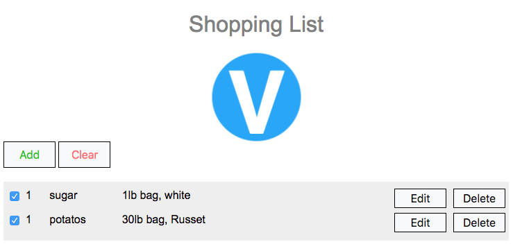

# Viage Shopping List Tutorial

## Adding CSS
Viage uses some Webpack functionality to take the contents of the index.css and compile and inline it into the dest/bundle.js file. All global styling should go into the src/index.css file. As a general rule of thumb the more style rules you have the bigger your DOM memory footprint and the slower the DOM will be able to render.

I recommend using inline styles for specific component styling and use Global styles sparingly. However, not all CSS features are usable in inline form. Things like psuedo selectors and CSS animations just aren't possible in inline styling.

You can also specify style tags in a component's HTML. The style rules will be effective across the entire document, so you have to be careful on your selector choices, but when the component goes away it's specific styling gets removed from the DOM.

### Example Style Tags in a Component's HTML
```Javascript
  this.setHTML(`
    <style type="text/css">
    shopping-list-element {
      color: blue
    }
    </style>
    <button attach="add">Add</button>
    <button attach="clear">Clear</button>
    <div attach="list" style="margin-top:20px;width:575px"></div>
  `);
```
In this example you can see a style tag that will be applied to *shopping-list-element* and some inline style in the *div list container*.

All normal CSS rules apply and all CSS features are available as Viage does nothing to get in the way of the DOM's CSS processor.

### Making the App look pretty
For the sake of this demo I am going to make this easy by adding all the CSS changes into the global CSS file. Add the folowing lines to the src/index.css file:
```css
body {
font-family: "Segoe UI",Arial,sans-serif;
font-weight: 400;
}

input[type=checkbox], input[type=radio] {
  box-sizing: border-box;
  padding: 0;
}

h1 {
  color:gray;
  font-weight: 100;
}

button {
  color: #111;
  background-color: #f8f9fa;
  border-color: #f8f9fa;
  display: inline-block;
  font-weight: 400;
  text-align: center;
  white-space: nowrap;
  vertical-align: middle;
  user-select: none;
  border: 1px solid black;
  padding: .375rem .75rem;
  font-size: 1rem;
  line-height: 1.5;
  transition: background-color .15s ease-in-out,border-color .15s ease-in-out,box-shadow .15s ease-in-out;
  min-width: 75px;
}

button:hover {
  background-color: #e2e6ea;
}

input {
  padding: .375rem .75rem;
  font-size: 1rem;
  line-height: 1.5;
  color: #495057;
  background-color: #fff;
  background-image: none;
  background-clip: padding-box;
  border: 1px solid #ced4da;
  border-radius: .25rem;
  transition: border-color ease-in-out .15s,box-shadow ease-in-out .15s;
}
```

This is just standard CSS nothing special. After applying these changes your app should now look like this:



### [Next (Conclusion)](conclusion.md)

