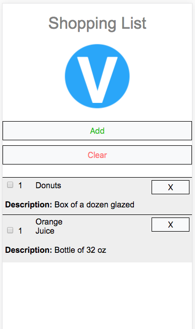

# Viage Shopping List Tutorial

## Making the App Responsive
Because Viage is very unobtrusive, making a Viage app responsive is exactly the same as on most platforms. The main mechanisms that are used are CSS media queries and smart use of HTML and CSS. You will also notice so overall CSS cleanup as most of the styling is moved into index.css

### CSS Media Queries
CSS Media queries allow you to define CSS classes based on DOM properties such as height and width. In this App we will use a width of 600px as the delimter between mobile and desktop modes. If you can change the look by just using style without having to change the HTML, this is best approach. However, this is not always possible. You can also create classes that hide and show elements based on media queries. Using this approach, you can have multiple HTML blocks that are active based on the screen size.

### Tables are not very Responsive
You will notice some pretty significant changes to the shoppingListAdd component. This is bascially a conversion from a table implementation to a div implementation so that CSS only changes can change the layout from desktop mode to mobile mode. This really highlights why tables should be avoided in a responsive design.

### index.css
Here is what the resultant index.css file now looks like. The media queries are located at the bottom, notice the addition of the **mobile** and **not-mobile** classes

```Css
body { font-family: "Segoe UI",Arial,sans-serif; font-weight: 400; margin: 0px; min-width: 280px; }
.label { display: block; margin-left: auto; margin-right: auto; text-align: center; font-weight: 800; }
.input { border-radius: 0px; margin-bottom: 15px; display: block; margin-left: auto; margin-right: auto; }
.red { color: #ff6e6e }
.green { color: #00c700 }
.blue { color: #0085ff }
.shopping-list { margin-top: 20px; background-color: #eeeeee; padding: 5px; }
.list-item { width: 100%; margin-top: 5px; margin-bottom: 5px; }
.fadeout { transition: .5s; opacity: 0; }
.fadein { transition: .5s; opacity: 1; }
input[type=checkbox], input[type=radio] { box-sizing: border-box; padding: 0; }
h1 { color:gray; font-weight: 100; }
button:hover { background-color: #e2e6ea; }
.logo-img { background-image: url("./assets/logo.png"); width: 129px; height: 128px; margin-left: auto; margin-right: auto; margin-bottom: 20px; }
.mobile-list-item { width: 100%; margin-top: 5px; margin-bottom: 5px; margin-left: -5px; padding: 5px; border-top-style: solid; border-width: 1px; }
button {
  color: #111;
  background-color: #f8f9fa;
  border-color: #f8f9fa;
  display: inline-block;
  font-weight: 400;
  text-align: center;
  white-space: nowrap;
  vertical-align: middle;
  user-select: none;
  border: 1px solid black;
  padding: .375rem .75rem;
  font-size: 1rem;
  line-height: 1.5;
  transition: background-color .15s ease-in-out,border-color .15s ease-in-out,box-shadow .15s ease-in-out;
  min-width: 75px;
}
input {
  padding: .375rem 5px;
  font-size: 1rem;
  line-height: 1.5;
  color: #495057;
  background-color: #fff;
  background-image: none;
  background-clip: padding-box;
  border: 1px solid #ced4da;
  border-radius: .25rem;
  transition: border-color ease-in-out .15s,box-shadow ease-in-out .15s;
}
/* if screen width less than 600px*/
@media only screen and (max-width: 600px) {
  body { margin: 0px; }
  .mobile { display: block; }
  .not-mobile { display: none; }
  .button { margin-top: 5px; margin-bottom: 5px; width: 100%; }
  .list-item { margin-left: -5px; padding: 5px; border-top-style: solid; border-width: 1px; }
  .shopping-list { padding-top: 0px; }
  .quantity-container { width: 100%; display: block; }
  .name-container { width: 100%; display: block; }
  .description-container { width: 100%; display: block; }
  .input { width: 95vw; }
}
/* if screen width greater than 600px*/
@media only screen and (min-width: 600px) {
  body { margin: 8px; }
  .mobile { display: none; }
  .not-mobile { display: block; }
  .list-item { height: 30px; }
  .save-button { margin-left: 4px; }
  .quantity-container { width: 70px; display: inline-block; }
  .name-container { width: 150px; display: inline-block; margin-left: 15px; }
  .description-container { width: 320px; display: inline-block; margin-left: 15px; }
  .input { width: 100%; }
}
```

### shopping-list-element.ts
The changes to this file include utilization of the mobile and not-mobile class which hide and show blocks of HTML based on screen width:
```Javascript
import { Component } from 'viage';
import { Item, ShoppingListService } from '../services/shopping-list-service';
import { States } from './app';

interface Id {
  id: string;
}

export class ShoppingListElement extends Component {

  private item: Item;

  constructor() {
    super('shopping-list-element');
  }

  init(item: Item) {
    this.item = item;
    this.setHTML(`
      <div class="not-mobile list-item">
        <input attach="enabled" type="checkbox" ${item.purchased ? "checked": ""} />
        <span style="width: 30px; display: inline-block">${item.quantity}</span>
        <span style="width: 20%; display: inline-block">${item.name}</span>
        <span style="width: 40%; display: inline-block">${item.description}</span>
        <button attach="delete" style="padding: 1px; float: right">Delete</button>
        <button attach="edit" style="padding: 1px; float: right; margin-right: 10px;">Edit</button>
      </div>
      <div attach="m_edit" class="mobile list-item">
        <input attach="m_enabled" type="checkbox" ${item.purchased ? "checked": ""} />
        <span style="width: 30px; display: inline-block">${item.quantity}</span>
        <span style="width: 20%; display: inline-block">${item.name}</span>
        <button attach="m_delete" style="padding: 1px; float: right">X</button>
        <div style="display: block; margin-top:20px;">
          <label style="font-weight:800">Description: </label>
          <span style="width: 40%;" >${item.description}</span>
        </div>
      </div>
   `);
    const attachments = this.attachments;
    const remove = () => ShoppingListService.removeItem(this.item._id);
    const enable = () => {
      this.item.purchased = attachments.enabled.checked;
      ShoppingListService.save();
    };
    const edit = () => {
      const url = this.router.createUrl<Id>(States.EDIT, {id: this.item._id});
      this.router.go(url);
    };
    attachments.delete.addEventListener('click', remove);
    attachments.m_delete.addEventListener('click', remove);
    attachments.enabled.addEventListener('click', enable);
    attachments.m_enabled.addEventListener('click', enable);
    this.attachments.edit.addEventListener('click', edit);
    this.attachments.m_edit.addEventListener('click', edit);
    return this;
  }
}
```

### shopping-list-add
The changes to this file are mostly about converting it from table based html to div based html. In this file the html is shared across both the mobile and desktop views. The different looking views are based soley on CSS changes in the Media Queries:

```Javascript
import { Component } from 'viage';
import { ShoppingListService } from '../services/shopping-list-service';
import { States } from './app';
import * as logo from '../assets/logo.png';

interface ComponentParams {
  id?: string;
}

export class ShoppingListAdd extends Component {

  params: ComponentParams = {id: ''};
  fields = ['quantity', 'name', 'description'];

  constructor() {
    super('shopping-list-add');
  }

  init(params: ComponentParams) {
    this.setHTML(`
    <div style="background-image: url(${logo}); width: 129px; height: 128px; margin-left: auto; margin-right: auto; margin-bottom: 20px;"></div>
    <h3 class="not-mobile" style="margin-left: 6px; color: green">${params && params.id ? 'Edit' : 'Add Item'}</h3>
    <div class="quantity-container">
      <label class="label">Quantity</label>
      <input class="input" type="number" attach="quantity"/>
    </div>
    <div class="name-container">
      <label class="label">Name</label>
      <input class="input" type="text" attach="name"/>
    </div>
    <div class="description-container">
      <label class="label">Description</label>
      <input class="input" type="text" attach="description"/>
    </div>
    <div>
      <button class="save-button button green" attach="save">Save</button>
      <button class="button blue" attach="back">Back</button>
    <div>
    `);
    const attachments = this.attachments;
    this.params = params;
    if (params && params.id) {
      this.updateItem();
    }

    attachments.save.addEventListener('click', () => {
      const item: any = { purchased: false };
      this.fields.forEach(k => item[k] = attachments[k].value);
      item.quantity = parseInt(item.quantity); // ensure this is a number
      if (!this.params.id) {
        ShoppingListService.addItem(item);
      } else {
        const data: any = ShoppingListService.getItem(this.params.id);
        this.fields.forEach(k => data[k] = item[k]);
        ShoppingListService.save();
      }
      const homeUrl = this.router.createUrl<void>(States.HOME);
      this.router.go(homeUrl);
    });

    // handle back
    attachments.back.addEventListener('click', () => this.router.back());
    return this;
  }

  updateItem() {
    const data: any = ShoppingListService.getItem(this.params.id);
    this.fields.forEach((k: string) => this.attachments[k].value = data && data[k]);
  }
}
```

## Screen Shots
Here is what these changes look like with a screen width less 600px:

### Home


### Edit


### [Next (Conclusion)](conclusion.md)