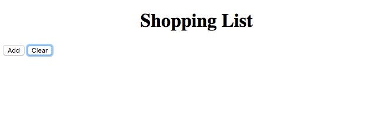

# Viage Shopping List Tutorial

## Adding Routes
Viage has a built in hash router that is light weight and easy to use. The great thing about Viage is that if you want to use a different router, go for it! It should be fairly straightforward to integrate into your project given Viage's very small and unobtrusive footprint.

### Setting up the Router
Modify the code in src/components/app so it looks like the following:

```Javascript
import { ShoppingList } from './shopping-list';
import { createRouter, Component } from 'viage';

export class App extends Component {

  title = "Shopping List";

  constructor() {
    super('app');
    document.querySelector('title').textContent = this.title;

    this.attach('page', true);
    this.setHTML(`
      <h1 style="text-align: center">${this.title}</h1>
      <div attach="portal"></div>
    `);

    const router = createRouter('main', this.attachments.portal, true);
    router.addStates([
      { name: 'home', component: ShoppingList,  paramsList: [] },
    ]);
    router.setDefaultState('#home');
  }
}
```

### Adding a Portal
The Router needs somewhere to render into. Notice that we added a new div that gets attached with the name *portal*.

Next we create a router named *main*, give it our portal div to render into, and tell it to use the DOM location API.

### Adding Router States
Next we add router states. The name will be translated to the url #home. When that url is activated a *ShoppingList* component is created nad attached to the portal. When the route or state is changed, the then the active component is deleted and a new one is created based on the route configuration.

### Setting a Default Router State
Lastly you will note that we set a default state. This is the state that comes up when the app starts up.

### Viewing the Changes so far
Our app is complete enough that it will actually render in the browser. It is not much to look at because there are no items in our shopping list yet. You should see something that looks like:



### Next Steps
Now we need to add the ability to add an element so we can actually have something in our list to view. The next section builds out the *shopping-list-add* component

### [Next (Adding a Shopping List add Component)](shopping-list-add.md)