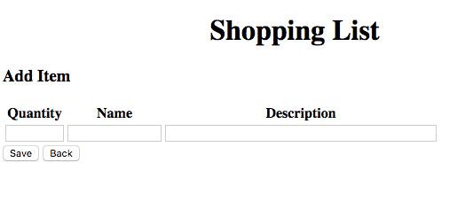
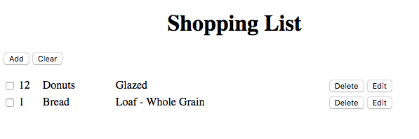

# Viage Shopping List Tutorial

## Creating the Shopping List Add Component
This component will be the view that is used to add an item to the Shopping List. Start by using the CLI to create a *shopping-list-add component*.

``` viage component shopping-list-add ```


Now modify the code so that it looks lke this:

```Javascript
import { Component } from 'viage';
import { ShoppingListService } from '../services/shopping-list-service';
import { getRouter } from 'viage';

export class ShoppingListAdd extends Component {

  fields = ['quantity', 'name', 'description'];

  constructor(params: any) {
    super('shopping-list-add');
    this.setHTML(`
      <h3>Add Item</h3>
      <table>
        <tr>
          <th>Quantity</th>
          <th>Name</th>
          <th>Description</th>
        </tr>
        <tr>
          <td><input type="number" attach="quantity" style="width: 60px" /></td>
          <td><input type="text" attach="name" style="width: 100px" /></td>
          <td><input type="text" attach="description" style="width: 300px" /></td>
        </tr>
      </table>
      <button attach="save">Save</button>
      <button attach="back">Back</button>
    `);
    const attachments = this.attachments;

    attachments.save.addEventListener('click', () => {
      const item: any = {enabled: false};
      this.fields.forEach(k => item[k] = attachments[k].value);
      ShoppingListService.addItem(item);
      getRouter('main').go('#home');
    });

    attachments.back.addEventListener('click', () => getRouter('main').back());
  }
}
```

At this point none of this should be new. This is very much like the other components that we have created. The HTML is simply a table of fields that can be edited. The text inputs all have attachemnts to the component, as do the *save* and *back* buttons.

### Save Button
The *save* button has a click handler attached to it and it gathers each input field and constructs an object that is sent to the *ShoppingListService.addItem()* function. Once the call is complete it calls the router to go to the *home* state. In a app that calls a server to save, you might want to configure the service to return a promise whenever an async operation is performed.

### Back Button
The back button calls the *router.back()* function which tells the router to go back to the previous state or the default state if no previous state exists. This is emulating the back button functionality on the browser. If fact if you hit the back button on the browser it will accomplish the same thing.

### Installing a Route
The only thing left is to let the router know about this new state. Add the following code into the src/components/app.ts file so that the router states match this:

```Javascript
router.addStates([
      { name: 'home', component: ShoppingList,  paramsList: [] },
      { name: 'add', component: ShoppingListAdd,  paramsList: [] },
    ]);
```

Don't forget to import the ShoppingListAdd component by adding the following to the top of the src/components/app.ts file:

```Javascript
import { ShoppingListAdd } from './shopping-list-add';
```

### Test it out
Finally we can add items to our shopping list and then display them. Press the add button on the app running in the browser and add some items. Your shopping-list-add screen should look like this:



And the populated list should now look something like this:



You should be able to Add, Delete, View, Mark as Purchased, and Clear the list. You can even refresh the browser and it will keep the list intact because the contents are saved and retrieved from Localstorage.

### Editing
The only functionality missing is the ability to edit an item.

### [Next (The Shopping List Edit Component)](shopping-list-edit.md)
