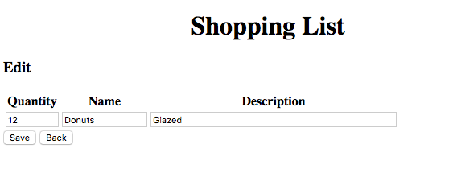

# Viage Shopping List Tutorial

## Adding Edit Functionality
It turns out that Adding and Editing an Item are very similar in functionality. It makes sense to use the *shopping-list-add* component to edit as well. We just have to be able to pass in a item id so that the add component knows how to pre-populate the component.

### Passing in Params
Viage Components have a params member that can set by the router when the object is created. This allows you to have parameters in the urls that trigger state changes. If you were paying attention you saw that the *edit* button in the shopping-list-element component had a handler that looked like this:

```Javascript
  this.attachments.edit.addEventListener('click', () => {
    getRouter('main').go(`#edit/${this.item._id}`);
  });
```
This creates a url for the router that contains the items Id.

### Adding a new Router State
Let's add one more Router state to src/components/app.ts. Modify the router states in that fiel so they now look like this:

```Javascript
    router.addStates([
      { name: 'home', component: ShoppingList,  paramsList: [] },
      { name: 'add', component: ShoppingListAdd,  paramsList: [] },
      { name: 'edit', component: ShoppingListAdd,  paramsList: ['id'] },
    ]);
```

The edit route will reuse the ShoppingListAdd component and will also look for a parameter in the URL and assign it the name id. You can have multiple fields in the parameter list they just need to be seperated by a '/' in the url. When the router changes state to the edit route, it will create a new ShoppingListAdd component and assign the params member to:

```Javascript
  this.params = {id: <id>};
```

### Adding Edit functionality to the Shopping List Add Component
Modify the src/components/shopping-list-add.ts component so that it now looks like this:

```Javascript
import { Component } from 'viage';
import { ShoppingListService } from '../services/shopping-list-service';
import { getRouter } from 'viage';

export class ShoppingListAdd extends Component {

  params = {id: ''};
  fields = ['quantity', 'name', 'description'];

  constructor(params: any) {
    super('shopping-list-add');
    this.setHTML(`
      <h3>${params && params.id ? 'Edit' : 'Add Item'}</h3>
      <table>
        <tr>
          <th>Quantity</th>
          <th>Name</th>
          <th>Description</th>
        </tr>
        <tr>
          <td><input type="number" attach="quantity" style="width: 60px" /></td>
          <td><input type="text" attach="name" style="width: 100px" /></td>
          <td><input type="text" attach="description" style="width: 300px" /></td>
        </tr>
      </table>
      <button attach="save">Save</button>
      <button attach="back">Back</button>
    `);
    const attachments = this.attachments;
    this.params = params;
    if (params && params.id) {
      this.updateItem();
    }

    attachments.save.addEventListener('click', () => {
      const item: any = {enabled: false};
      this.fields.forEach(k => item[k] = attachments[k].value);
      if (!this.params.id) {
        ShoppingListService.addItem(item);
      } else {
        const data: any = ShoppingListService.getItem(this.params.id);
        this.fields.forEach(k => data[k] = item[k]);
        ShoppingListService.save();
      }
      getRouter('main').go('#home');
    });

    // handle back
    attachments.back.addEventListener('click', () => getRouter('main').back());
  }

  updateItem() {
    const data: any = ShoppingListService.getItem(this.params.id);
    this.fields.forEach(k => this.attachments[k].value = data && data[k]);
  }
}
```

You will note a few small differences. The h3 element in the HTML now conditionally renders *Edit* or *Add Item* based on whether there is a params.id element present.

There is now an *updateItem()* function that goes out the service and gets the data for the item passed in via the *params* member. This is also called in the constructor when an id is present so the fields can be populated correctly with that item's data.

Finally, the save function now had different functionality based on whether the we are in add mode or edit mode.

### Test it out
Now our app has the ability to edit, save, delete, clear, and display our shopping list. The new edit functionality should look something like the image below:



### Functional but Ugly!
So our app is functional but it could sure use some style. Viage does not get in the way or try to interpret CSS at all letting you take full advantage of some of the amazing CSS features that are part of the modern DOM.

### [Next (Adding CSS)](css.md)
